# STREAMS

## Lab 1: Dart Streams

### Step 1: Create a New Project
Create a new flutter project named stream_name (give it your nickname) in the week-12/src/ folder of your GitHub repository.

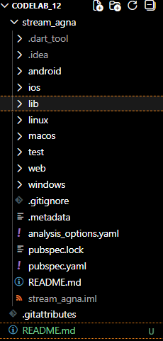

### Step 2: Open the filemain.dart
Type the code as follows.

```dart:
import 'package:flutter/material.dart';
import 'stream.dart';

void main() {
  runApp(const MyApp());
}

class MyApp extends StatelessWidget {
  const MyApp({super.key});

  @override
  Widget build(BuildContext context) {
    return MaterialApp(
      title: 'Stream - Agna',   // Jawaban Q1
      theme: ThemeData(
        primarySwatch: Colors.blue,   // Diganti sesuai selera (Jawaban Q1)
      ),
      home: const StreamHomePage(),
    );
  }
}

class StreamHomePage extends StatefulWidget {
  const StreamHomePage({super.key});

  @override
  State<StreamHomePage> createState() => _StreamHomePageState();
}

class _StreamHomePageState extends State<StreamHomePage> {
  Color bgColor = Colors.blueGrey;
  late ColorStream colorStream;

  @override
  void initState() {
    super.initState();
    colorStream = ColorStream();
    changeColor();
  }

  void changeColor() async {
    await for (var eventColor in colorStream.getColors()) {
      setState(() {
        bgColor = eventColor;
      });
    }
  }

  @override
  Widget build(BuildContext context) {
    return Scaffold(
      appBar: AppBar(title: const Text('Stream')),
      body: Container(
        decoration: BoxDecoration(color: bgColor),
      ),
    );
  }
}
```

- Question 1
Add your nickname to titlethe app as an identity for your work.
Change the application theme color according to your preference.
Commit the answer to Question 1 with the message "W12: Answer to Question 1"

The answer is on step 1 and 2

### Step 3: Create a new filestream.dart
Create a new file in your project's lib folder. Then, fill it with the following code.

```dart:
import 'package:flutter/material.dart';

class ColorStream {
  final List<Color> colors = [
    Colors.blueGrey,
    Colors.amber,
    Colors.deepPurple,
    Colors.lightBlue,
    Colors.teal,

    // 5 warna tambahan (jawaban Q2)
    Colors.red,
    Colors.green,
    Colors.orange,
    Colors.pink,
    Colors.indigo,
  ];

  Stream<Color> getColors() async* {
    yield* Stream.periodic(
      const Duration(seconds: 1),
      (int t) {
        int index = t % colors.length;
        return colors[index];
      },
    );
  }
}
```

### Step 4: Add variablescolors
Add variables inside the class ColorStreamas follows.

```dart:
  final List<Color> colors = [
    Colors.blueGrey,
    Colors.amber,
    Colors.deepPurple,
    Colors.lightBlue,
    Colors.teal,
  ]
```
- Question 2
Add 5 more colors as you wish to colorsthe variable.
Commit the answer to Question 2 with the message "W12: Answer to Question 2"

```dart:
    // 5 warna tambahan (jawaban Q2)
    Colors.red,
    Colors.green,
    Colors.orange,
    Colors.pink,
    Colors.indigo,
  ];
```

### Step 5: Add methodgetColors()
In class ColorStreamthe method, type the following code. Note the asterisk at the end of the keyword async*(this is used to execute Streamdata).

```dart:
  Stream<Color> getColors() async* {
```

### Step 6: Add commandsyield*
Add the following code.

```dart:
yield* Stream.periodic(
      const Duration(seconds: 1),
      (int t) {
        int index = t % colors.length;
        return colors[index];
      },
    );
```

- Question 3
Explain the function of the keyword yield*in the code!
What does the code command mean?
Commit the answer to Question 3 with the message "W12: Answer to Question 3"

The yield* keyword is used to forward all events from another stream to the stream being created.

```dart:
yield* Stream.periodic(
      const Duration(seconds: 1),
      (int t) {
        int index = t % colors.length;
        return colors[index];
      },
    );
```
This means:

    - Stream.periodic generates a new color every 1 second,

    - and yield* sends all those color events to the caller of getColors().

So, yield* acts as an intermediary that forwards other streams without having to manually process each event individually.

### Step 7: Openmain.dart
Type this file import code in the filemain.dart

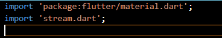

### Step 8: Add variables
Type these two properties insideclass _StreamHomePageState

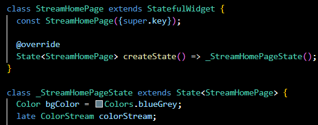

### Step 9: Add methodchangeColor()
Stay in the main file, type the code as follows


### Step 10: Perform overrideinitState()
When the code is like this

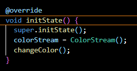

### Step 11: Change the contentsScaffold()
Adjust the code as follows.

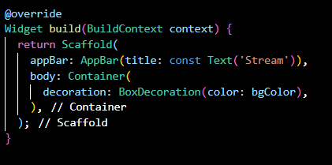

### Step 12: Run
Run your Flutter application and you will see the background color change every second.

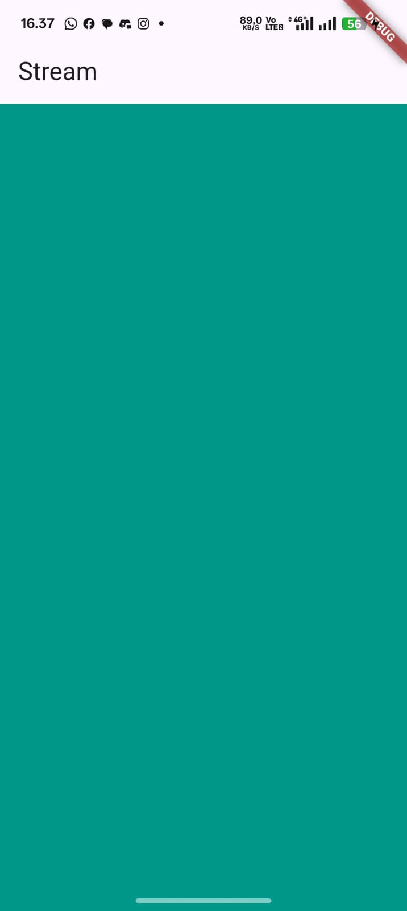 


- Question 4
Capture your practical results in GIF format and attach them to the README.
Commit the answer to Question 4 with the message "W12: Answer to Question 4"

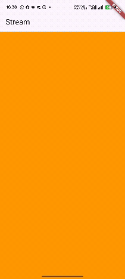

### Step 13: Change the contents of the methodchangeColor()
You can comment or delete the previous code, then when the code is like the following.

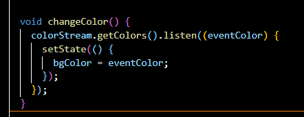

- Question 5
Explain the difference between using listenand await for(step 9)!
Commit the answer to Question 5 with the message "W12: Answer to Question 5"


1. await for
    - Used inside async functions.
    - Waits for each Stream data item sequentially (synchronous-like).
    - The process is blocking within the function until the Stream completes.
    - Suitable if you want to:
       -  process data one by one
        - wait for the stream to close before moving on to the next line

Example:
```dart
await for (var event in stream) {
print(event);
}
```

2. listen()
    - No need for async.
    - Produces a subscription that runs in the background.
    - The process is non-blocking, so other code continues running.
    - Suitable for:
        - Real-time UI updates
        - Reading a Stream that will never finish
        - Recurring events such as timers, sensors, or color changes

Example:
```dart:
stream.listen((event) {
print(event);
});
```

## Practical 2: Stream controllers and sinks

### Step 1: Open the filestream.dart
Perform import by typing this code.

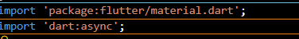

### Step 2: Addclass NumberStream
Still in the file stream.dartadd a new class as follows.

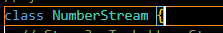

### Step 3: AddStreamController
Inside class NumberStreamcreate variables like the following.

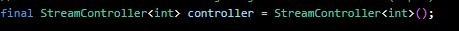

### Step 4: Add methodaddNumberToSink
Keep class NumberStreammaking this method
```dart:
  void addNumberToSink(int newNumber) {
    // Memasukkan data ke Sink
    controller.sink.add(newNumber);
  }
```

### Step 5: Add methodclose()
```dart:
  // Step 5: Tambahkan method close()
  // Wajib dipanggil di dispose() main.dart untuk menutup controller.
  void close() {
    controller.close();
  }
```

### Step 6: Openmain.dart
Type the import code as follows

### Step 7: Add variables
Inside class _StreamHomePageStatetype the following variables
```dart:
class _StreamHomePageState extends State<StreamHomePage> {
  // Step 7: Tambahkan variabel
  int lastNumber = 0;
  late StreamController numberStreamController;
  late NumberStream numberStream;
}
```

### Step 8: EditinitState()
```dart:
 @override
  void initState() {
    // Step 8: Inisialisasi dan Listen
    numberStream = NumberStream();
    numberStreamController = numberStream.controller;
    Stream stream = numberStreamController.stream;
  }
```

### Step 9: Edit dispose()
```dart:
  @override
  void dispose() {
    // Step 9: Tutup controller untuk mencegah memory leak
    numberStreamController.close();
    super.dispose();
  }
```

### Step 10: Add methodaddRandomNumber()
```dart:
  // Method untuk mengirim angka acak (Step 10)
  void addRandomNumber() {
    Random random = Random();
    int myNum = random.nextInt(10);

    // Memanggil method di NumberStream untuk memasukkan angka ke Sink
    numberStream.addNumberToSink(myNum);

    // Jika Anda mengerjakan Step 15 (Error Testing), ubah kode menjadi:
    // numberStream.addError();
  }
```

### Step 11: Edit methodbuild()
```dart:
// Step 11: Edit body
      body: SizedBox(
        width: double.infinity,
        child: Column(
          mainAxisAlignment: MainAxisAlignment.spaceEvenly,
          crossAxisAlignment: CrossAxisAlignment.center,
          children: [
            // Menampilkan angka terakhir dari stream
            Text(
              lastNumber.toString(),
              style: Theme.of(context).textTheme.headlineLarge,
            ),
            // Tombol untuk memicu pengiriman data (Step 11)
            ElevatedButton(
              onPressed: () => addRandomNumber(),
              child: const Text('New Random Number'),
            ),
          ],
        ),
      ),
```

### Step 12: Run
Run your Flutter application, it will look like the following image.


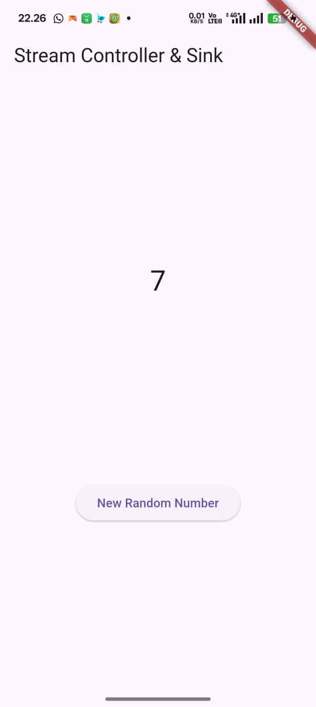


- Question 6
Explain the meaning of the code steps 8 and 10!
Capture your practical results in GIF format and attach them to the README.
Then do a commit with the message " W12: Answer to Question 6 ".

  1. Explanation of Step 8: initState() (The Receiver / Consumer Side)
  Step 8 is where your application starts listening for data changes.

  Controller Initialization: The code first creates a NumberStream object and retrieves the internal StreamController and its Stream (Stream stream = numberStreamController.stream). The Stream is the output channel where data will flow.

  Subscribing (.listen): The key function is stream.listen((event) { ... }). This is the act of subscribing to the stream. Whenever new data (called an event) is sent to the Sink (the controller's input), the code inside this callback is immediately executed.

  UI Reactivity: setState(() { lastNumber = event; }) is called inside the listener. This notifies Flutter to rebuild the UI and update the lastNumber variable with the latest data received, making the number displayed on the screen change reactively.

  2. Explanation of Step 10: addRandomNumber() (The Sender / Producer Side)
  Step 10 is the mechanism that triggers data to be sent into the stream.

  Data Production: The code uses Random().nextInt(10) to generate a random integer. This is the piece of data to be transmitted.

  Input to Sink: The crucial line is numberStream.addNumberToSink(myNum). This method essentially calls controller.sink.add(myNum). The Sink is the input to the Stream Controller. This .add() action initiates the data flow: the data is inserted into the Sink, flows through the Stream, and is immediately captured by Step 8 (stream.listen).

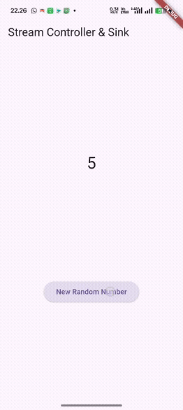

Step 13: Openstream.dart
Add the following method.

```dart:
  // Step 13: Tambahkan method addError
  // Digunakan oleh UI (main.dart) untuk memasukkan error ke stream (untuk pengujian).
  addError() {
    // Memasukkan error ke Sink
    controller.sink.addError('error');
  }
```


Step 14: Open main.dart
Add a method onErrorinside class StreamHomePageStatethe method listenin the function initState()like this.
```dart:
    .onError((error) {
      // Bagian ini diperlukan untuk Step 14 (Error Handling)
      setState(() {
        lastNumber = -1; // Tampilkan -1 jika terjadi error
      });
    });
```


Step 15: Edit methodaddRandomNumber()
Comment out the following two lines of code, then type the code as follows.
```dart:
    // Jika Anda mengerjakan Step 15 (Error Testing), ubah kode menjadi:
    numberStream.addError();
  }
```

Question 7
Explain the meaning of the code steps 13 to 15!
Return the code to its original state in Step 15, comment addError()it so you can proceed to the next practical 3.
Then do a commit with the message " W12: Answer to Question 7 ".

Steps 13 through 15 are designed to demonstrate how a Stream Controller can send an error event and how the Stream Listener can properly catch and handle that error, ensuring the application doesn't crash.

  1. Explanation of Step 13: addError() in stream.dart
  Purpose: This method provides the explicit mechanism to signal an error through the stream.

  controller.sink.addError('error');

  Unlike controller.sink.add() which sends normal data events (integers in this case), controller.sink.addError() sends an error object or message.

  When this is called, the stream outputs an error event, halting the normal flow of data.

  2. Explanation of Step 14: Adding onError in main.dart
  Purpose: To configure the stream listener in initState() to react specifically to error events.

  The existing stream.listen() call is modified by chaining the .onError((error) { ... }) callback.

  Handling Mechanism: When the listener receives the error event from Step 13, the code inside the .onError block is triggered.

  setState(() { lastNumber = -1; }); is executed. This is our error handling logic: it updates the UI to display -1, providing a visual indication that an error occurred on the data stream. If this handler were absent, the error would be thrown globally, potentially crashing the application.

  3. Explanation of Step 15: Editing addRandomNumber()
  Purpose: To temporarily test the error handling mechanism built in Step 14.

  The original code for generating and sending a random number is commented out (//numberStream.addNumberToSink(myNum);).

  It is replaced with numberStream.addError();.

  Effect: Now, every time the button is pressed, it deliberately calls the addError() method (from Step 13). This error travels through the stream, is caught by the .onError handler (Step 14), and results in the UI immediately displaying -1.

  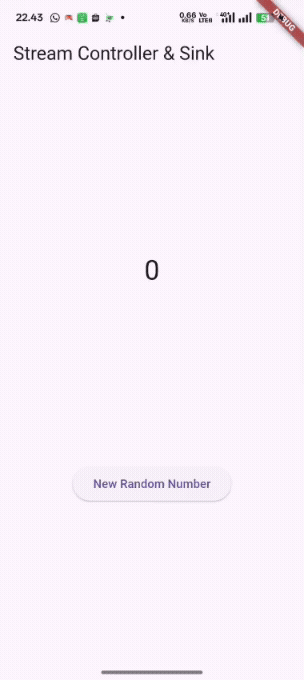

## Practical 3: Injecting data into streams
S
### tep 1: Openmain.dart
Add new variable insideclass _StreamHomePageState
```dart:
  // Step 1 lab 3: Tambahkan variabel transformer
  late StreamTransformer transformer;
```


### Step 2: Add this code ininitState
```dart:
    // Step 2: Buat StreamTransformer
    transformer = StreamTransformer<int, int>.fromHandlers(
      handleData: (value, sink) {
        // Logika Transformasi: Mengalikan setiap nilai yang masuk dengan 10.
        sink.add(value * 10);
      },
      handleError: (error, trace, sink) {
        // Logika Penanganan Error: Jika ada error, kirim nilai -1.
        sink.add(-1);
      },
      handleDone: (sink) => sink.close(),
    );
```

Step 3: Stay ininitState
Make edits like the following code.
```dart:
// Step 3: Masukkan transformer ke dalam aliran data sebelum listen
  stream
      .transform(transformer) // Transformer diterapkan di sini
      .listen((event) {
        setState(() {
          // Event yang diterima di sini sudah dikalikan 10
          lastNumber = event;
        });
      })
      .onError((error) {
        // Penanganan error lama ini sekarang redundant karena ada handleError di transformer, 
        // tetapi biarkan sesuai instruksi lab.
        setState(() {
          lastNumber = -1;
        });
      });

  super.initState();
```


Step 4: Run
Finally, run the program or press F5 to see the results if it's not already running. You can also perform a hot restart if the application is already running. The results will look like the image below. You'll see a number display ranging from 0 to 90.
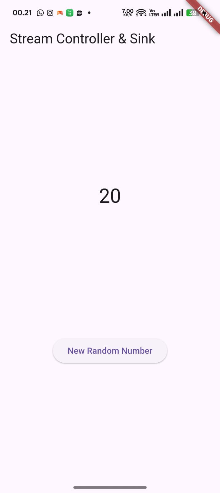

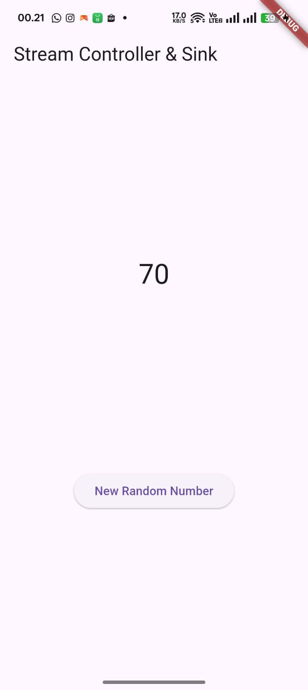

Question 8
Explain the meaning of the code steps 1-3!
Capture your practical results in GIF format and attach them to the README.
Then do a commit with the message " W12: Answer to Question 8 ".

Explanation of Step 1: Adding a Variable transformer
  - Code: late StreamTransformer transformer;
  - Purpose: Declare the variable transformer as an object of type StreamTransformer. This object is a block of code that can be inserted into a stream to process, validate, or transform the data flowing through it. Using late indicates that the variable will be initialized in initState(). 

Explanation of Step 2: Creating a StreamTransformer
  - Code: transformer = StreamTransformer<int, int>.fromHandlers(...)
  - Purpose: Create an instance of StreamTransformer that will transform incoming integer data into outgoing integer data (<int, int>). The .fromHandlers() method allows us to define custom logic to handle three types of events that can occur on the stream:

  1. handleData: (value, sink): This is the Transformation logic. Each incoming value will be processed. Here, the value is multiplied by 10 (sink.add(value * 10)). The sink used here is the Sink from the Transformer, not the Sink from the main Controller.

  2. handleError: (error, trace, sink): This is the Error Handling logic in the middle of the flow. If the stream throws an error, it can be handled here, and the Transformer can choose to send a safe value (e.g., -1) instead of letting the error persist.

  3. handleDone: (sink) => sink.close(): This is the Resource Cleanup logic that is executed when the main stream is closed.

Explanation of Step 3: Implementing StreamTransformer
  - Code: stream.transform(transformer).listen((event) { ... })
  - Purpose: Insert the created transformer into the stream pipeline.Flow 

  Mechanism:
  - The controller sends a random number (e.g., 5).
  - The number 5 flows through the stream.
  - The .transform(transformer) method captures the number.
  - handleData in Step 2 is triggered, calculating $5 \times 10 = 50$.
  - The value 50 is output from Transformer.listen((event) { ... }) receives 50, and lastNumber is updated to 50.

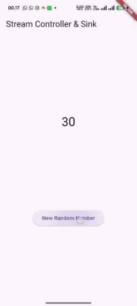

## Practical 4: Subscribe to stream events

### Step 1: Add variables
Add the following variables inclass _StreamHomePageState
```dart:
  // Step 1: Tambahkan StreamSubscription
  late StreamSubscription subscription;
```

Step 2: EditinitState()
Edit the code as follows.
```dart:
// Step 2: Tangkap Subscription dan terapkan Transformer
    subscription = stream
        .transform(transformer) 
        .listen((event) {
          setState(() {
            lastNumber = event; // Data yang diterima sudah dikalikan 10
          });
        });
```


Step 3: Stay ininitState()
Add the following code.
```dart:
    // Step 3: Tambahkan penanganan error ke objek subscription
    subscription.onError((error) {
      setState(() {
        lastNumber = -1;
      });
    }); 
```


Step 4: Add the onDone() property
Add below this code afteronError
```dart:
    // Step 4: Tambahkan onDone() ke objek subscription
    subscription.onDone(() {
      // ignore: avoid_print
      print('OnDone was called');
    });
```


Step 5: Add a new method
Type this method insideclass _StreamHomePageState
```dart:
  // Step 5: Method untuk menutup Controller
  void stopStream() {
    numberStreamController.close();
  }
```


Step 6: Move to methoddispose()
If the method dispose()doesn't exist, you can type it and override it. Type this code inside it.
```dart:
  @override
  void dispose() {
    // Step 6: Batalkan subscription saat widget dihapus (Best Practice)
    subscription.cancel();
    super.dispose();
  }
```


Step 7: Move to methodbuild()
Add a second button with the following code.
```dart:
            ElevatedButton(
              onPressed: () => stopStream(),
              child: const Text('Stop Subscription'),
            ),
```


Step 8: Edit methodaddRandomNumber()
Edit the code as follows.
```dart:

  // Step 8: Edit method addRandomNumber()
  void addRandomNumber() {
    Random random = Random();
    int myNum = random.nextInt(10);
    
    // Cek apakah controller sudah ditutup sebelum mengirim data
    if (!numberStreamController.isClosed) {
      numberStream.addNumberToSink(myNum);
    } else {
      setState(() {
        lastNumber = -1;
      });
    }
  }
```


Step 9: Run
You will see two buttons as shown in the following image.

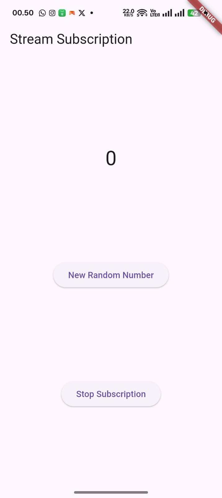

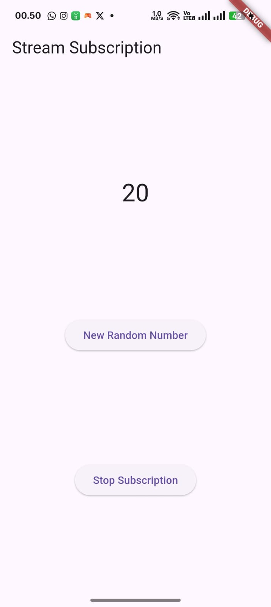


Step 10: Press the 'Stop Subscription' button
You will see a message in the Debug Console like the following.
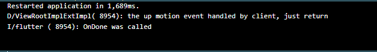


- Question 9
Explain the meaning of the code steps 2, 6 and 8!
Capture your practical results in GIF format and attach them to the README.
Then do a commit with the message " W12: Answer to Question 9 ".

What is a StreamSubscription? 

  A StreamSubscription is the object returned by the .listen() method. Instead of chaining methods (.listen().onError().onDone()) directly onto the Stream, which can become cumbersome, the Subscription offers a more structured and recommended approach (best practice) for controlling the stream listener.

Key Benefits and Controls
  - Lifecycle Control (.cancel()): This is its primary function. It allows you to explicitly stop the listener. This is critically important to do inside the widget's dispose() method (as seen in Step 6 of the practical) to prevent memory leaks if the widget is removed from the tree before the stream has finished or closed naturally.

  - Flexible Event Handling: You can register handling callbacks (onError, onDone) at any point after the subscription is created. This facilitates the separation of logic (as shown in Steps 3 & 4 of the practical).

  - State Management: It allows you to check the current status of the listener (for example, whether it is isPaused).


### Practicum 5: Multiple stream subscriptions

### Step 1: Open the filemain.dart
Type the following variables inclass _StreamHomePageState
```dart:
  // Practical 5, Step 1: Variabel baru
  late StreamSubscription subscription2; 
  String values = ''; 
```


### Step 2: EditinitState()
Type the code as follows.
```dart:
// Practical 5, Step 2: Listener Kedua (MENYEBABKAN ERROR PADA SINGLE-SUBSCRIPTION STREAM)
    subscription2 = stream.listen((event) {
        setState(() {
          values += 'Event: $event ';
        });
    }); // Baris ini akan melempar "Bad state: Stream has already been listened to."
```


### Step 3: Run
Run it and an error will appear as shown in the following image.

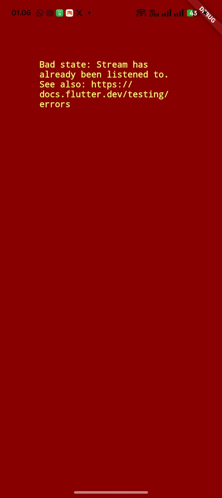

- Question 10
Explain why this error could occur?

The error occurred because the stream you were trying to use (i.e., numberStreamController.stream) is a Single-Subscription Stream by default.

1. Single-Subscription Stream Definition
A stream of this type is designed to have exactly one listener over its entire lifetime. Once the first listener (subscription) starts listening (stream.listen(...)), the stream becomes locked and begins producing events.

2. Error Trigger
When the code attempts to register a second listener (subscription2) on the same stream, the Dart runtime throws the error: Bad state: Stream has already been listened to.

3. Purpose
Single-subscription streams are typically used when the order of data is critical and must be processed sequentially, such as when reading data from a file or processing a single HTTP request.

### Step 4: Set broadcast stream
Type the code as follows in the methodinitState()
```dart:
// Practical 5, Step 4: Ubah menjadi Broadcast Stream
    // dan terapkan transformer ke stream sebelum digunakan
    Stream stream = numberStreamController.stream.asBroadcastStream().transform(transformer);
```    


### Step 5: Edit methodbuild()
Add text like this
```dart:
            // Practical 5, Step 5: Tampilkan nilai gabungan dari kedua listener
            Text(values), 
            // Tampilkan angka terakhir (dari listener pertama)
            Text(
              lastNumber.toString(),
              style: Theme.of(context).textTheme.headlineLarge,
            ),
```


### Step 6: Run
Press the ' New Random Number ' button several times, then the number text will appear and increase by two times.

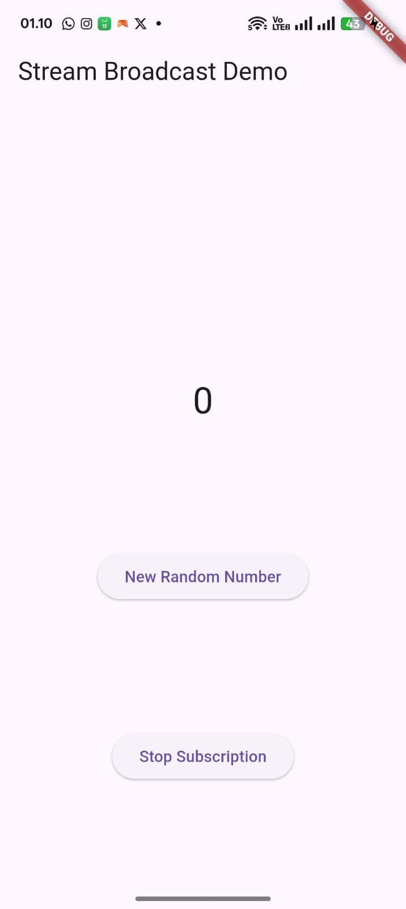

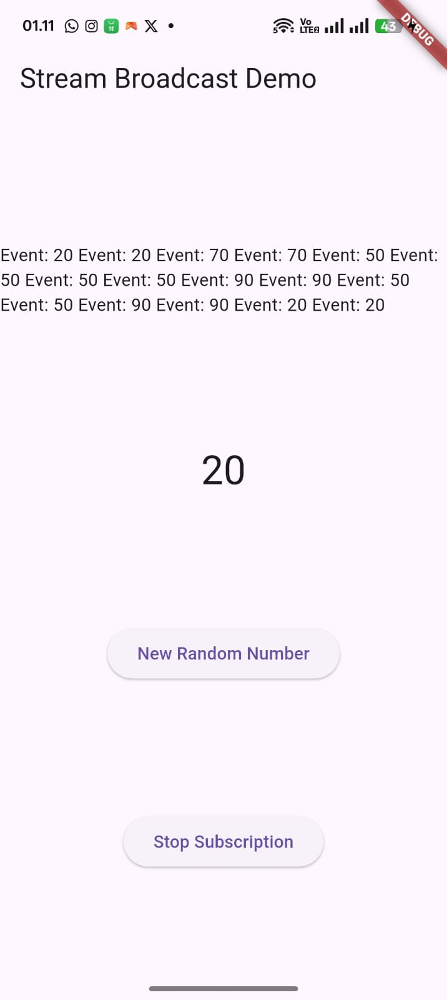

- Question 11
Explain why this could happen?
Capture your practical results in GIF format and attach them to the README.
Then do a commit with the message " W12: Answers to Questions 10,11 ".

The value appears doubled (in pairs) because the stream was converted into a Broadcast Stream, which allows multiple listeners to receive the same event simultaneously.

  - Single Sending Action: When the 'New Random Number' button is pressed, the Controller executes controller.sink.add(myNum) only once. This is a single event sent into the stream.

  - Broadcast Mechanism: Because the stream is now a Broadcast Stream (due to the use of .asBroadcastStream()), that single event is broadcast to all registered listeners.

Two Listeners, Two Outputs:

  - subscription receives the event and appends a string entry to the values variable.

- subscription2 receives the exact same event and appends a second, identical string entry to values.

Result: Each time data is sent, setState() is effectively triggered twice (once by each listener), and the values variable accumulates two identical string entries from that single data event.

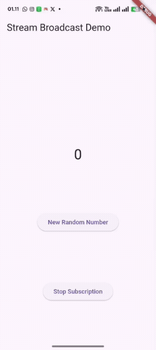

## Lab 6: StreamBuilder

### Step 1: Create a New Project
Create a new flutter project named streambuilder_nama (give it your nickname) in the week-12/src/ folder of your GitHub repository.

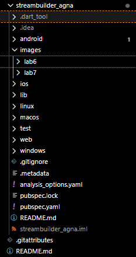

### Step 2: Create a new filestream.dart
Type this code
```dart:
// stream.dart
import 'dart:async';
import 'dart:math';

class NumberStream {}
```

### Step 3: Stay in the filestream.dart
Type the code as follows.
```dart:
  // Step 3: Method yang mengembalikan Stream periodik
  Stream<int> getNumbers() async* {
    yield* Stream.periodic(const Duration(seconds: 1), (int t) {
      Random random = Random();
      int myNum = random.nextInt(10);
      return myNum; // Mengembalikan angka acak (0-9)
    });
  }
```


### Step 4: Edit main.dart
Type the code as follows.
```dart:
// main.dart
import 'package:flutter/material.dart';
import 'stream.dart';
import 'dart:async';

void main() {
  runApp(const MyApp());
}

class MyApp extends StatelessWidget {
  const MyApp({super.key});

  @override
  Widget build(BuildContext context) {
    return MaterialApp(
      title: 'Stream',
      theme: ThemeData(
        primarySwatch: Colors.deepPurple,
      ),
      home: const StreamHomePage(),
    );
  }
}

class StreamHomePage extends StatefulWidget {
  const StreamHomePage({super.key});

  @override
  State<StreamHomePage> createState() => _StreamHomePageState();
}

class _StreamHomePageState extends State<StreamHomePage> {
  // Step 5: Tambahkan variabel Stream
  late Stream<int> numberStream;

  @override
  void initState() {
    // Step 6: Inisialisasi Stream
    numberStream = NumberStream().getNumbers();
    super.initState();
  }

  @override
  Widget build(BuildContext context) {
    return Scaffold(
      appBar: AppBar(
        title: const Text("StreamBuilder Demo"),
      ),
      // Step 7: Gunakan StreamBuilder
      body: StreamBuilder<int>(
        stream: numberStream,
        initialData: 0, // Nilai awal sebelum data pertama tiba
        builder: (context, snapshot) {
          
          // 1. Penanganan Error
          if (snapshot.hasError) {
            print('Error! ${snapshot.error}');
            return const Center(child: Text('Error!'));
          }

          // 2. Penanganan Data
          if (snapshot.hasData) {
            return Center(
              child: Text(
                snapshot.data.toString(),
                style: const TextStyle(fontSize: 96),
              ),
            );
          } 
          
          // 3. Penanganan Loading (snapshot.hasData false)
          else {
            return const Center(child: CircularProgressIndicator());
          }
        },
      ),
    );
  }
}
```


### Step 5: Add variables
Inside class _StreamHomePageState, when this variable.
```dart:
class _StreamHomePageState extends State<StreamHomePage> {
  // Step 5: Tambahkan variabel Stream
  late Stream<int> numberStream;
}
```


### Step 6: EditinitState()
Type the code as follows.
```dart:
@override
  void initState() {
    // Step 6: Inisialisasi Stream
    numberStream = NumberStream().getNumbers();
    super.initState();
  }
```


### Step 7: Edit methodbuild()
```dart:
// Step 7: Gunakan StreamBuilder
      body: StreamBuilder<int>(
        stream: numberStream,
        initialData: 0, // Nilai awal sebelum data pertama tiba
        builder: (context, snapshot) {
          
          // 1. Penanganan Error
          if (snapshot.hasError) {
            print('Error! ${snapshot.error}');
            return const Center(child: Text('Error!'));
          }

          // 2. Penanganan Data
          if (snapshot.hasData) {
            return Center(
              child: Text(
                snapshot.data.toString(),
                style: const TextStyle(fontSize: 96),
              ),
            );
          } 
          
          // 3. Penanganan Loading (snapshot.hasData false)
          else {
            return const Center(child: CircularProgressIndicator());
          }
        },
      ),
```


Step 8: Run
As a result, every second a new number will appear as follows.

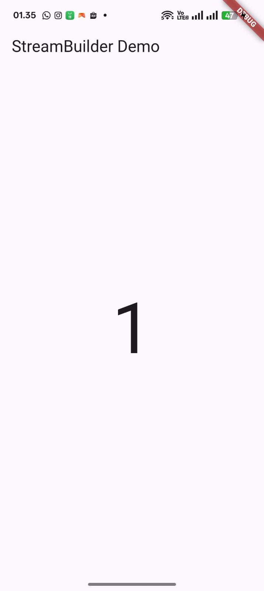

- Question 12
Explain the meaning of the code in steps 3 and 7!
Capture your practical results in GIF format and attach them to the README.
Then do a commit with the message " W12: Answer to Question 12 ".

Here is the explanation for Question 12 (Steps 3 and 7) translated into English.

❓ Answer to Question 12: Explanation of Steps 3 and 7
The question asks for an explanation of the code responsible for generating the stream (Step 3) and the code responsible for updating the UI reactively (Step 7).

1. Explanation of Step 3: getNumbers() in stream.dart (The Stream Producer) 

Step 3 defines the method that generates the periodic Stream using Dart's asynchronous capabilities. This code acts as the data source.

  - Stream<int> getNumbers() async* { ... }: This method is declared as an async* (asynchronous generator), meaning it returns a Stream. Its return type is specifically Stream<int> (a flow of integer data).

  - yield* Stream.periodic(...): This is the core instruction that creates and forwards the events.

    - Stream.periodic(const Duration(seconds: 1), ...) creates a stream that emits events at regular, specified intervals (every 1 second).

    - yield* takes all events generated by Stream.periodic and passes them directly into the stream returned by getNumbers().

  - Event Logic: The logic inside the periodic callback generates a random integer (myNum) between 0 and 9, which is the value emitted with each event.

Purpose: This code serves as the producer. It continuously and automatically generates a new, unbounded stream of random numbers every second.

2. Explanation of Step 7: StreamBuilder in main.dart (The Stream Consumer) 

Step 7 uses the StreamBuilder widget to listen for events from the stream created in Step 3 and update the UI reactively. This code acts as the reactive consumer.

  - stream: numberStream: This property links the StreamBuilder to the data source initialized in initState(). The StreamBuilder automatically subscribes to this stream when the widget is created.

  - initialData: 0: Provides a starting value (0) to display before the first actual data event is received. This prevents a temporary empty or loading screen (a blank state) immediately after the app loads.

  - builder: (context, snapshot) { ... }: This is a callback function that is executed every time the Stream emits a new event (either data or an error). The snapshot object holds the stream's current status and data.

    - snapshot.hasError: Checks if the stream emitted an error event.

    - snapshot.hasData: Checks if the stream has successfully emitted valid data.

    - snapshot.data.toString(): If data exists, its value is extracted from the snapshot and used to build the Text widget.

Purpose: This code is the reactive consumer. Every time numberStream produces a new random number, the StreamBuilder receives the event and automatically calls its builder function to rebuild the contained widgets (the Text displaying the number), all without needing any manual setState() calls.


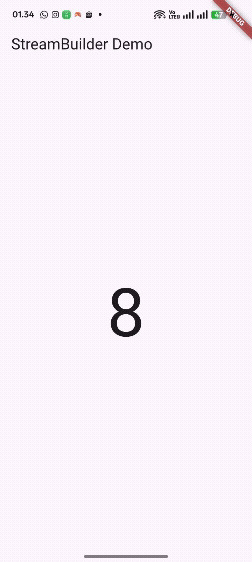


## Practical 7: BLoC Pattern

### Step 1: Create a new project
Create a new Flutter project named bloc_random_nama (give it your nickname) in the week-12/src/ folder of your GitHub repository. Then, create a new file in the folder libnamedrandom_bloc.dart

Step 2: Fill in the coderandom_bloc.dart
Type the following import code.


Step 3: Createclass RandomNumberBloc()


Step 4: Create variablesStreamController
Inside class RandomNumberBloc()type the following variables


Step 5: Create a constructor


Step 6: Create a methoddispose()


Step 7: Editmain.dart


Step 8: Create a new filerandom_screen.dart
Inside libyour project folder, create this new file.

Step 9: Import materials andrandom_bloc.dart
Type this code in a new filerandom_screen.dart


Step 10: Create a StatefulWidget RandomScreen
Create it in the filerandom_screen.dart

Step 11: Create variables
Type this code insideclass _RandomScreenState


Step 12: Create a methoddispose()
Type this code insideclass _StreamHomePageState


Step 13: Edit methodbuild()
Type this code insideclass _StreamHomePageState


Run the application, then you will see random numbers between 0 and 9 every time you press the button FloactingActionButton.

Question 13
Explain the purpose of this practicum! Where does the BLoC pattern concept lie?
Capture your practical results in GIF format and attach them to the README.
Then do a commit with the message " W12: Answer to Question 13 ".
